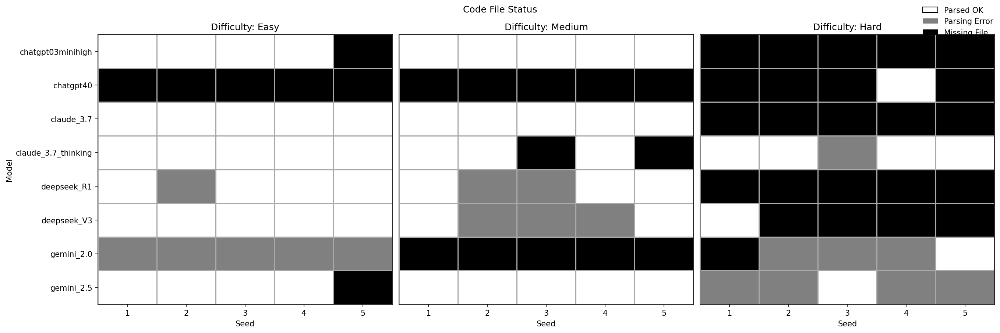
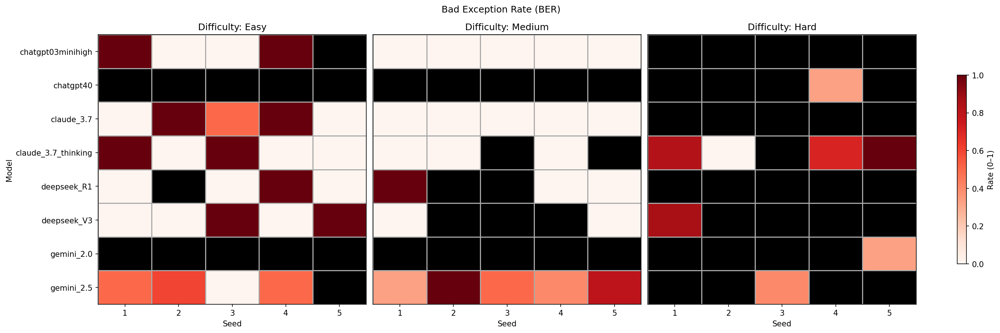

# Silent Killers  
### An Exploratory Audit of Exception‑Handling in LLM‑Generated Python


[](https://pypi.org/project/silent-killers/)

> **tl;dr** We show that large‑language models often add `try/except`
> blocks that *silently swallow* errors.  Our AST‑based metric pipeline
> lets anyone quantify that risk across thousands of generated scripts
> in seconds.

---


## 1  Scope of this study

Modern LLMs can write Python that “runs”, but *how* it fails matters.
A **bare** `except:` or a blanket `except Exception:` with no
re‑raise can mask fatal bugs, leading to silent data corruption or
debugging nightmares—these are the **silent killers**.

We collected **5 seeds × 8 models × 3 prompts** (easy → hard rewrite
tasks) and asked:

* How often do models inject `try/except` at all?  
* Of those, how many are “bad” under a strict re‑raise rule?  
* Does difficulty exacerbate the problem?

The full paper is on my portfolio: 
[https://julianquick.com/ML/llm-audit.html](https://julianquick.com/ML/llm-audit.html).

---

## 2 Quick start

```
$ # generate example scripts to analyze
$ printf "try:\n    print(10 / 0)\nexcept:\n    pass\n" > example.py
$ silent-killers-audit example.py

❌ example.py: 1 bad exception block(s)

```


### 2.1  Generate metrics CSVs

```bash
python scripts/process_files.py --base-dir data/propagation_prompt
python scripts/process_files.py --base-dir data/calibration_prompt
python scripts/process_files.py --base-dir data/optimization_prompt
```

Each run creates

```
data/<prompt_dir>/
    llm_code_metrics.csv
    llm_response_metrics.csv
```

### 2.2  Plots & summary tables

```bash
python scripts/post_processing.py --root data
```

Creates:

```
plots_grid_refactored/
    grid_status_3color.png
    grid_loc_continuous.png
    grid_bad_exception_rate.png
    grid_bad_exception_count.png
    bar_parsed_ok_by_difficulty.png
    summary_by_model.csv
    summary_by_difficulty.csv
```

<details>
<summary>Example output</summary>

| code‑status | bad‑rate heatmap |
|-------------|------------------|
|  |  |

</details>

### 2.3  Library usage

```python
from silent_killers.metrics_definitions import code_metrics

python_code = "try:\n    1/0\nexcept Exception:\n    pass"
for metric in code_metrics(python_code):
    print(metric.name, metric.value)
```

### 2.4  Use in pre-commit
```
- repo: https://github.com/kilojoules/silent-killers
  rev: v0.1.7
  hooks:
    - id: silent-killers-audit

```

---


## 3  Repository layout

```
repo-root/
├─ src/
│   └─ silent_killers/            ← reusable package
│        ├─ __init__.py
│        └─ metrics_definitions.py     (AST visitors & regex metrics)
│        └─ llm_api.py                 (interface analysis with different LLM APIs)

├─ tests/                          ← reusable package unit tests
│   └─ test_exception_labels.py
│
├─ scripts/                        ← analysis scripts
│   ├─ process_files.py            (generates metrics CSVs)
│   └─ post_processing.py          (creates plots & summary tables)
│   └─ run_experiments.py          (runs the 3 prompts using the models in models.yaml)
│
├─ data/                           ← study‑specific artifacts
│   ├─ calibration_prompt/         (easy rewrite task)
│   ├─ propagation_prompt/         (medium rewrite task)
│   ├─ optimization_prompt/        (hard rewrite task)
│   └─ figures/                    (output plots & visualizations)
│ 
├─ pyproject.toml
|
└─ README.md
```


---

## 4  Installation

```bash
git clone https://github.com/kilojoules/silent-killers.git
cd silent-killers
python -m pip install --upgrade pip
pip install -e .
```

or using the pypi distribution

```bash
pip install silent-killers
```


> **Requires Python ≥ 3.10**  
> Runtime deps: `pandas`, `numpy`, `matplotlib`

---

## 5  Metrics at a glance

| metric | description |
|--------|-------------|
| `exception_handling_blocks` | count of `except` clauses |
| `bad_exception_blocks` | bare `except:` **or** `except Exception:` *without* `raise` |
| `bad_exception_rate` | `bad / total`, 2 dp |
| `uses_traceback` | calls `traceback.print_exc()` / `.format_exc()` |
| … | see `src/silent-killers/metrics_definitions.py` |

---

## 6  Key pilot finding

> **When a model adds *any* error handling, 50–100 % of those handlers
> are unsafe.**  
> Inclusive bad‑rates look tame (0 – 0.6) but conditional bad‑rates
> (`only_with_try`) spike to **1.0** for several models on simple
> prompts.

> For these reasons, we recoomend using the silent-killers-audit tool in pre-commit workflows. 

---

## 7  Development

```bash
ruff check .          # lint
pytest                # run unit tests
coverage run -m pytest && coverage html
```

CI runs on GitHub Actions across Python 3.10 and 3.11 (see `.github/workflows/ci.yml`).

---

## 8  Roadmap

* 🚧 dynamic execution traces (runtime errors, coverage)  
* 🚧 extend to other unsafe patterns
* 🚧 support more languages than Python

PRs & issues welcome!

---

## 9  License & citation

MIT License.  
If you use the metrics or figures, please cite:

```bibtex
@misc{Quick2025SilentKillers,
  title  = {Silent Killers: An Exploratory Audit of Exception‑Handling in LLM‑Generated Python},
  author = {Julian Quick},
  year   = {2025},
  url    = {https://github.com/kilojoules/silent-killers}
}
```

*Happy auditing – don’t let silent errors slip through!*

