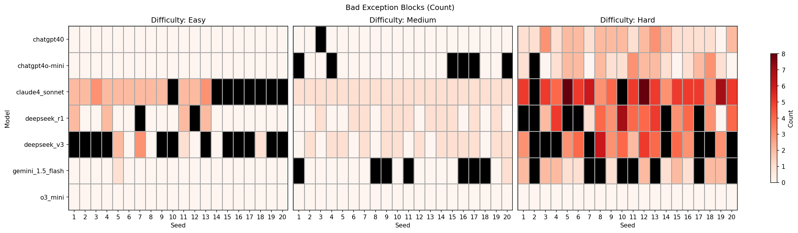

# Silent Killers
### An Exploratory Audit of Exception-Handling in LLM-Generated Python


[](https://pypi.org/project/silent-killers/)

> **tl;dr** We show that large-language models often add `try/except`
> blocks that *silently swallow* errors.  Our AST-based metric pipeline
> lets anyone quantify that risk across thousands of generated scripts
> in seconds.



---


## 1 Quick start

```
$ printf "try:\n    print(10 / 0)\nexcept:\n    pass\n" > bad_block_example.py
$ printf "print('this is a line') ; new_variable = 123 ; print('this code is fine')" > safe_example.py
$ pip install silent-killers
$ silent-killers-audit bad_block_example.py
❌ example.py: 1 bad exception block(s) found on line(s): 3
$ silent-killers-audit safe_example.py
$
```

### 1.1  Use in pre-commit

Add this to `.pre-commit-config.yaml`:

```
- repo: https://github.com/kilojoules/silent-killers
  rev: v0.1.7
  hooks:
    - id: silent-killers-audit

```

### 1.2  Library usage

```python
from silent_killers.metrics_definitions import code_metrics

python_code = "try:\n    1/0\nexcept Exception:\n    pass"
for metric in code_metrics(python_code):
    print(metric.name, metric.value)
```

```
loc 4
exception_handling_blocks 1
bad_exception_blocks 1
bad_exception_locations [3]
pass_exception_blocks 1
total_pass_statements 1
bad_exception_rate 1.0
uses_traceback False
parsing_error  # None
```


---

## 2  Installation

```bash
git clone https://github.com/kilojoules/silent-killers.git
cd silent-killers
python -m pip install --upgrade pip
pip install -e .
```

or using the pypi distribution

```bash
pip install silent-killers
```


> **Requires Python >= 3.10**
> Runtime deps: `pandas`, `numpy`, `matplotlib`

---

## 3  Repository layout

```
repo-root/
├─ src/
│   └─ silent_killers/            <- reusable package
│        ├─ __init__.py
│        └─ metrics_definitions.py     (AST visitors & regex metrics)
│        └─ llm_api.py                 (interface analysis with different LLM APIs)

├─ tests/                          <- reusable package unit tests
│   └─ test_exception_labels.py
│
├─ scripts/                        <- analysis scripts
│   ├─ process_files.py            (generates metrics CSVs)
│   └─ post_processing.py          (creates plots & summary tables)
│   └─ run_experiments.py          (runs the 3 prompts using the models in models.yaml)
│
├─ data/                           <- study-specific artifacts
│   ├─ calibration_prompt/         (easy rewrite task)
│   ├─ propagation_prompt/         (medium rewrite task)
│   ├─ optimization_prompt/        (hard rewrite task)
│   └─ figures/                    (output plots & visualizations)
│
├─ pyproject.toml
|
└─ README.md
```

---

## 4  Scope of this study

Modern LLMs can write Python that "runs", but *how* it fails matters.
Any `except` handler that does not re-raise can mask fatal bugs,
leading to silent data corruption or debugging nightmares -- these are
the **silent killers**.

We collected **20 seeds x 7 models x 3 prompts** (easy, medium, hard
rewrite tasks) using **strict mode** (any handler without `raise` is
flagged) and asked:

* How often do models inject `try/except` at all?
* Of those, how many are "bad" under a strict re-raise rule?
* Does difficulty exacerbate the problem?

### Models audited

| Model | Provider |
|-------|----------|
| GPT-4o | OpenAI |
| GPT-4o-mini | OpenAI |
| o3-mini | OpenAI |
| Claude Sonnet 4 | Anthropic |
| DeepSeek V3 | DeepSeek |
| DeepSeek R1 | DeepSeek |
| Gemini 1.5 Flash | Google |

The full write-up is on my portfolio:
[https://julianquick.com/ML/llm-audit.html](https://julianquick.com/ML/llm-audit.html).

---


## 5  Metrics at a glance

| metric | description |
|--------|-------------|
| `exception_handling_blocks` | count of `except` clauses |
| `bad_exception_blocks` | any `except` handler *without* `raise` (strict mode) |
| `bad_exception_rate` | `bad / total`, 2 dp |
| `uses_traceback` | calls `traceback.print_exc()` / `.format_exc()` |
| ... | see `src/silent_killers/metrics_definitions.py` |

---

## 6  Key findings

> **When a model adds *any* error handling, 50-100% of those handlers
> are unsafe** (no re-raise). Conditional bad-rates spike to **1.0**
> for several models on simple prompts.

| Model | Easy | Medium | Hard |
|-------|------|--------|------|
| o3-mini | 0.00 | 0.00 | 0.00 |
| GPT-4o | 0.00 | 0.00 | 0.93 |
| GPT-4o-mini | 0.00 | 0.00 | 0.75 |
| Gemini 1.5 Flash | 0.05 | 0.08 | 1.00 |
| DeepSeek R1 | 0.22 | 0.55 | 0.72 |
| DeepSeek V3 | 0.50 | 0.65 | 0.78 |
| Claude Sonnet 4 | 1.00 | 1.00 | 0.83 |

*Mean bad exception rate across 20 seeds per cell (strict mode).*

**Highlights:**
- **o3-mini** is the only model with a 0.00 bad rate across all difficulties.
- **Claude Sonnet 4** had the highest bad rate on easy/medium prompts (1.00).
- **GPT-4o** and **Gemini 1.5 Flash** performed well on simpler tasks but spiked on hard prompts.
- **DeepSeek V3** showed consistently elevated bad rates across all difficulties.

We recommend using the `silent-killers-audit` tool in pre-commit workflows.

---

## 7  Development

```bash
ruff check .          # lint
pytest                # run unit tests
coverage run -m pytest && coverage html
```

CI runs on GitHub Actions across Python 3.10 and 3.11 (see `.github/workflows/ci.yml`).

---

## 8  Roadmap

* dynamic execution traces (runtime errors, coverage)
* extend to other unsafe patterns
* support more languages than Python

PRs & issues welcome!

---

## 9  License & citation

MIT License.
If you use the metrics or figures, please cite:

```bibtex
@misc{Quick2025SilentKillers,
  title  = {Silent Killers: An Exploratory Audit of Exception-Handling in LLM-Generated Python},
  author = {Julian Quick},
  year   = {2025},
  url    = {https://github.com/kilojoules/silent-killers}
}
```

*Happy auditing -- don't let silent errors slip through!*
